# AJP — Advanced Java Programming

**Course:** Advanced Java Programming (AJP)
**Topics:** JDBC Connectivity, Servlets, Session Tracking, Database Operations
**Environment:** Java 21, Apache Tomcat 10.1.57, MySQL 9.x, Jakarta Servlet API 6.0

---

## Table of Contents

- [Day 1 — JDBC](#day-1--jdbc)
- [Day 2 — Servlets](#day-2--servlets)
- [How to Run](#how-to-run)
- [Tech Stack](#tech-stack)

---

## Day 1 — JDBC

### Class Work

---

#### Q1 — JDBC Connectivity & CRUD Operations
**File:** `src/classWork/Q1_JDBCConnectivity.java`

Demonstrates basic JDBC connectivity: loads the MySQL driver, connects to the database, creates an `employees` table, inserts two rows, performs SELECT, UPDATE, and DELETE operations.

```bash
# Run from Eclipse: Right-click → Run As → Java Application
```

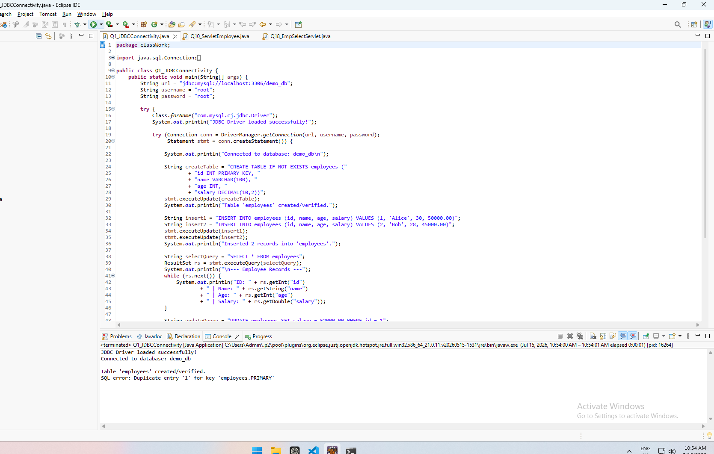

---

#### Q2 — Create `emp` Table and Insert Rows
**File:** `src/classWork/Q2_EmpTable.java`

Creates a table `emp` with fields `id`, `name`, `city` and inserts two rows using JDBC `Statement`. Verifies the data by querying and printing all records.

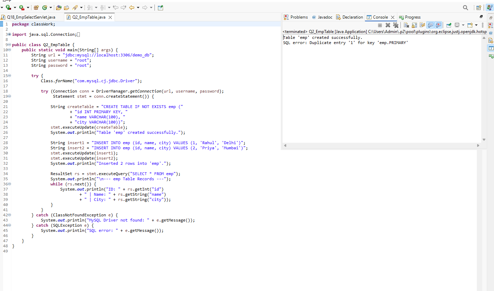

---

#### Q3 — Create `Students` Table
**File:** `src/classWork/Q3_CreateStudents.java`

Uses `Statement` to create a table `Students` with fields `id`, `name`, `age`, and `grade`. Verifies table creation using database metadata.

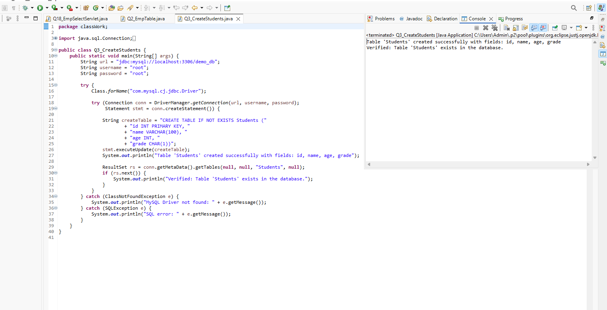

---

#### Q4 — Insert Multiple Records into Students
**File:** `src/classWork/Q4_InsertStudents.java`

Inserts five student records into the `Students` table using multiple `Statement.executeUpdate()` calls. Displays all records after insertion.

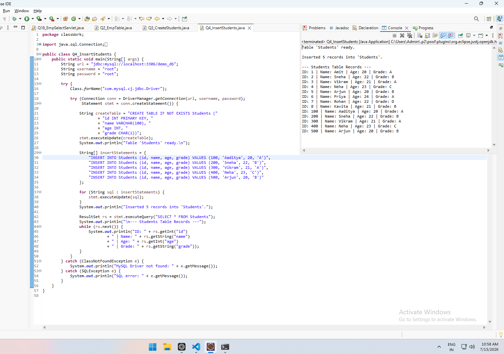

---

#### Q5 — Money Transfer Transaction
**File:** `src/classWork/Q5_MoneyTransfer.java`

Demonstrates transaction management: transfers Rs.3000 from Account 1 (Ravi) to Account 2 (Suresh) using `setAutoCommit(false)`, `commit()`, and `rollback()`. Ensures both debit and credit are atomic.

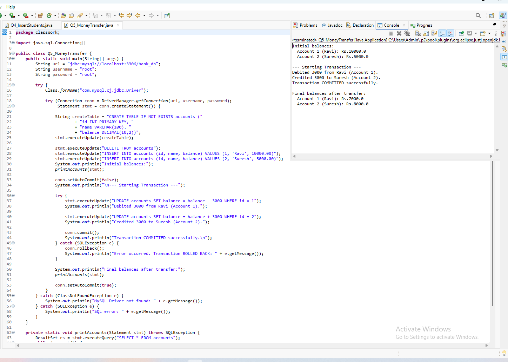

---

#### Q6 — Delete Students Below Grade Threshold
**File:** `src/classWork/Q6_DeleteByGrade.java`

Uses `PreparedStatement` to delete student records where the grade is below a user-specified threshold. Takes grade input via `Scanner` and executes parameterized DELETE query.

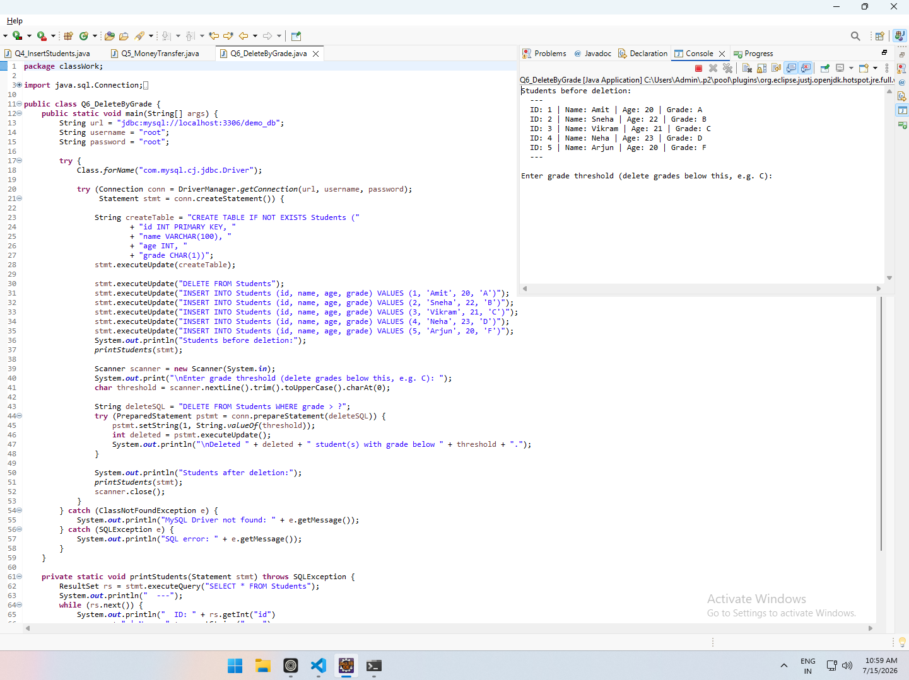

---

### Home Assignment

---

#### Q7 — Batch Insert with PreparedStatement
**File:** `src/homeWork/Q7_BatchInsert.java`

Efficiently inserts multiple records using `PreparedStatement` batch execution (`addBatch()` / `executeBatch()`). Inserts 8 student records in a single batch with transaction control.

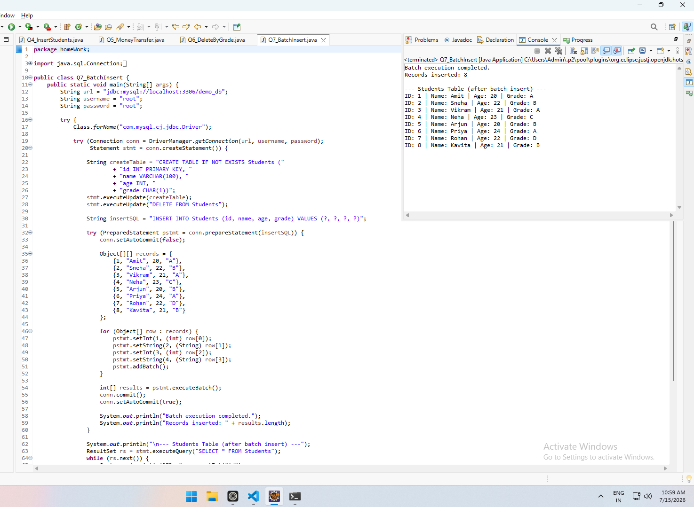

---

#### Q8 — Stored Procedure: Total Salary
**File:** `src/homeWork/Q8_StoredProcedure.java`

Creates a MySQL stored procedure `TotalSalary` that calculates the total salary of employees in a given department. Calls it using `CallableStatement` with an OUT parameter.

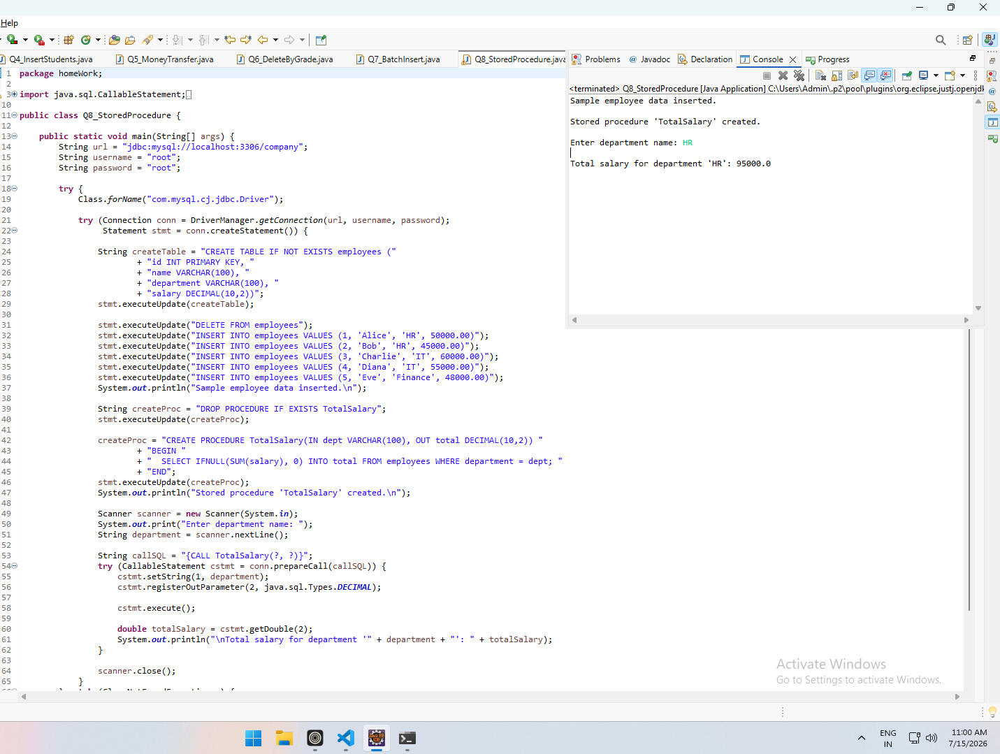

---

#### Q9 — TCL Statements Demo
**File:** `src/homeWork/Q9_TCLStatements.java`

Demonstrates Transaction Control Language: `setAutoCommit(false)`, `commit()`, `rollback()`, `setSavepoint()`, and `releaseSavepoint()` on an `Employee` table. Shows full transaction lifecycle.

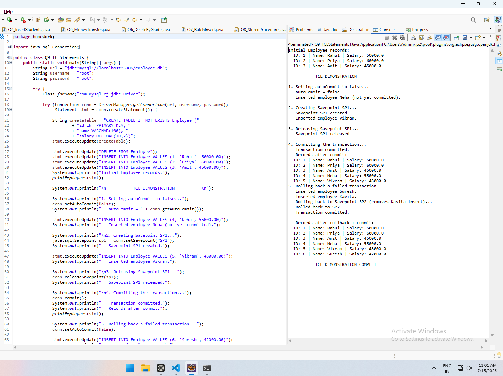

---

## Day 2 — Servlets

### Class Work

---

#### Q10 — Servlet: Employee Details Display
**File:** `src/homeWork/servlet/Q10_ServletEmployee.java`
**URL:** `http://localhost:8080/AJP/EmployeeDetails`

Servlet that selects employee details (emp_id, empname, empadd, empphone) from the database and displays them in an HTML table on the browser.

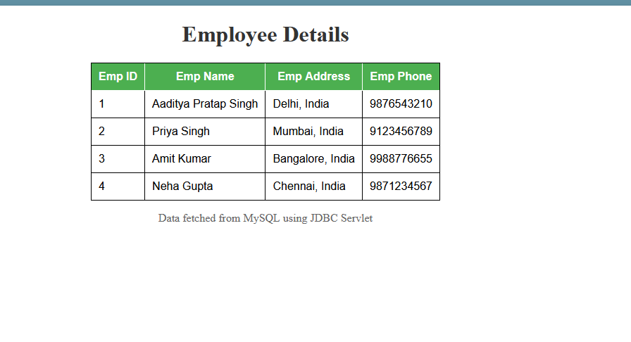

---

#### Q11 — GenericServlet: Employee Registration
**File:** `src/classWork/servlet/Q11_EmployeeRegistration.java`
**Form:** `WebContent/employee_registration.html`
**URL:** `http://localhost:8080/AJP/employee_registration.html`

A `GenericServlet` that accepts employee details (name, email, designation, salary) via POST form, stores them in the database using JDBC, and displays a success message.

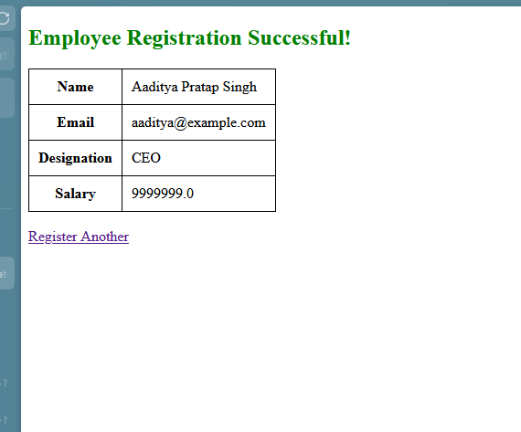

---

#### Q12 — Servlet: Name and Password Display
**File:** `src/classWork/servlet/Q12_NamePassword.java`
**Form:** `WebContent/name_password_form.html`
**URL:** `http://localhost:8080/AJP/name_password_form.html`

Receives Name and Password from an HTML page via POST and displays them on the browser.

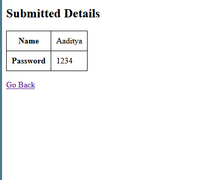

---

#### Q13 — Servlet: Redirect to Google
**File:** `src/classWork/servlet/Q13_RedirectToGoogle.java`
**URL:** `http://localhost:8080/AJP/RedirectToGoogle`

Uses `sendRedirect()` to redirect the request to `https://www.google.com`.

---

#### Q14 — Session Handling with HttpSession
**File:** `src/classWork/servlet/Q14_HttpSessionDemo.java`
**Form:** `WebContent/session_form.html`
**URL:** `http://localhost:8080/AJP/session_form.html`

Demonstrates session tracking using `HttpSession`. Stores user name and email as session attributes, displays session ID and stored data.

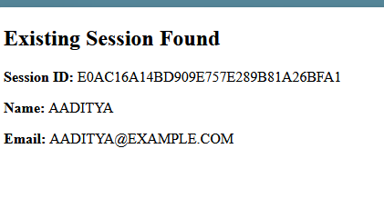

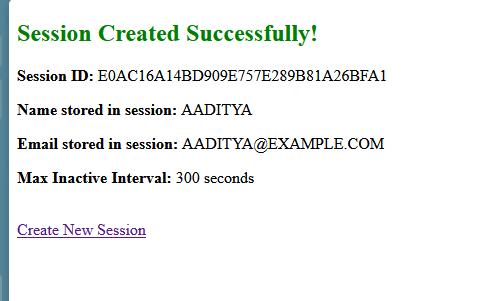

---

#### Q15 — Session Handling with URL Rewriting
**File:** `src/classWork/servlet/Q15_URLRewriting.java`
**Form:** `WebContent/urlrewrite_form.html`
**URL:** `http://localhost:8080/AJP/urlrewrite_form.html`

Implements session tracking using URL rewriting via `response.encodeURL()`. Session data persists through rewritten URLs containing the session ID.

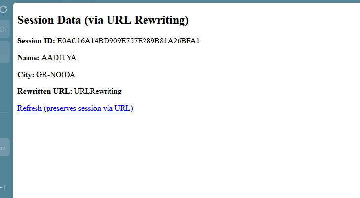

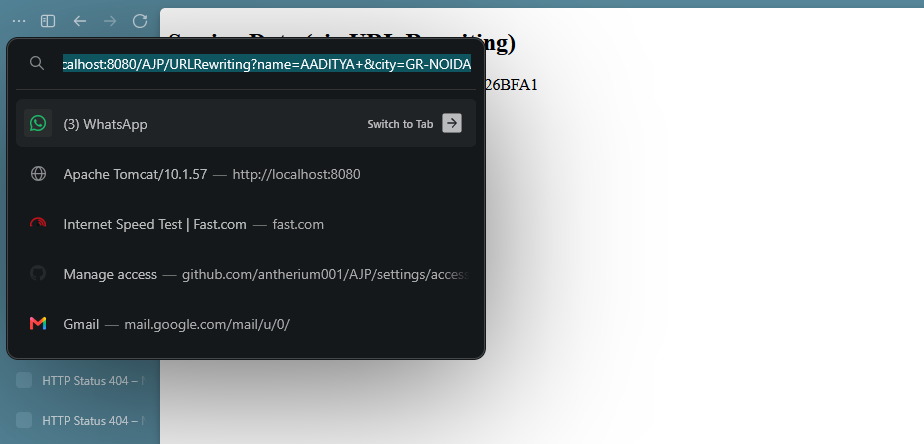

---

#### Q16 — Cookie ID with Session
**File:** `src/classWork/servlet/Q16_CookieSession.java`
**URL:** `http://localhost:8080/AJP/CookieSession`

Displays the JSESSIONID cookie along with session details (ID, creation time, last accessed time) and lists all cookies sent by the browser.

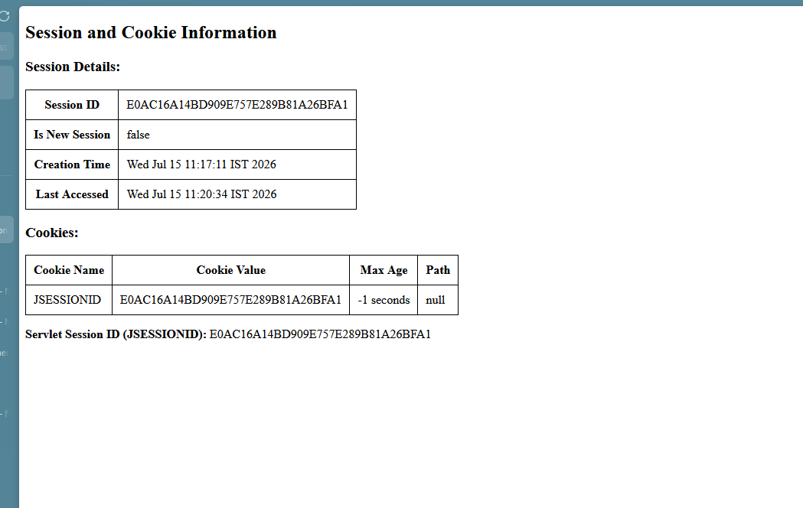

---

#### Q17 — Servlet: User Form Display
**File:** `src/classWork/servlet/Q17_UserFormServlet.java`
**Form:** `WebContent/user_form.html`
**URL:** `http://localhost:8080/AJP/user_form.html`

Takes three inputs — User Name, User Password, and User Mobile — from an HTML form and displays them on the browser in a formatted table.

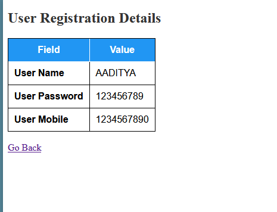

---

### Home Assignment

---

#### Q18 — Servlet: Select Employee Details
**File:** `src/homeWork/servlet/Q18_EmpSelectServlet.java`
**URL:** `http://localhost:8080/AJP/EmpSelect`

Selects employee details (emp_id, empname, empadd, empphone) from the database and displays them in an HTML table on the browser.

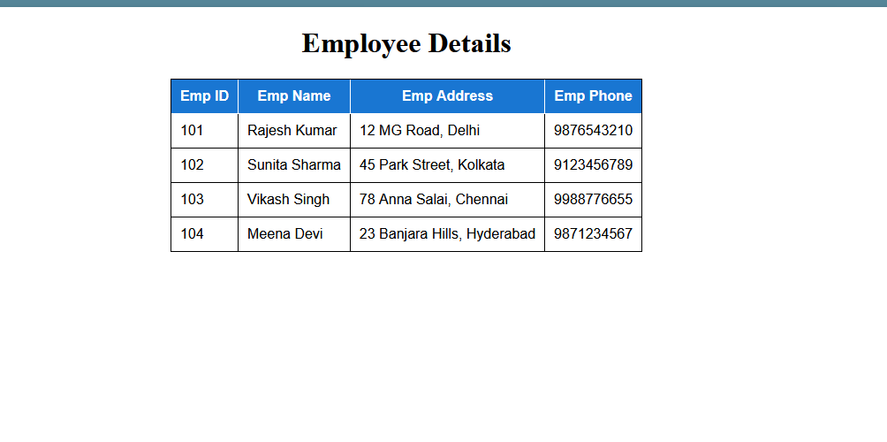

---

#### Q19 — Cookies: Add and Access Data
**File:** `src/homeWork/servlet/Q19_CookieDemo.java`
**Form:** `WebContent/cookie_form.html`
**URL:** `http://localhost:8080/AJP/cookie_form.html`

Adds custom data to cookies and also accesses and displays all existing cookies from the browser.

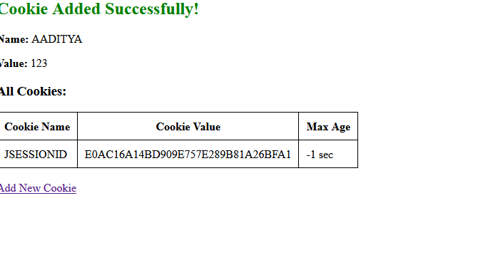

---

#### Q20 — Redirect to HTML File
**File:** `src/homeWork/servlet/Q20_RedirectToHTML.java`
**Target:** `WebContent/redirect_target.html`
**URL:** `http://localhost:8080/AJP/RedirectToHTML`

Implements redirection to other resources — redirects to a static HTML page using `sendRedirect()`.

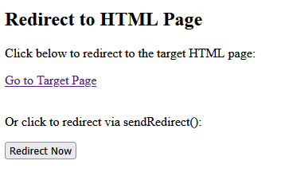

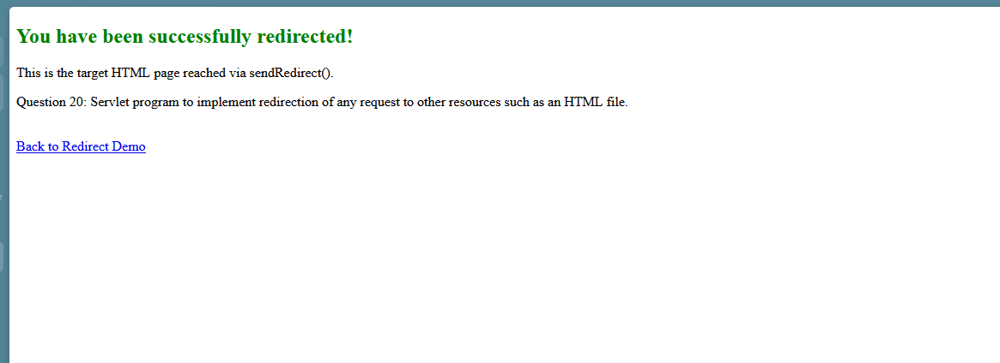

---

#### Q21 — Registration Form with Database
**File:** `src/homeWork/servlet/Q21_RegistrationServlet.java`
**Form:** `WebContent/registration.html`
**URL:** `http://localhost:8080/AJP/registration.html`

Full registration flow: form with name, password, email, phone. Inserts into database on submit, displays all registered users. Table contains: name, password, email-id, phone number.

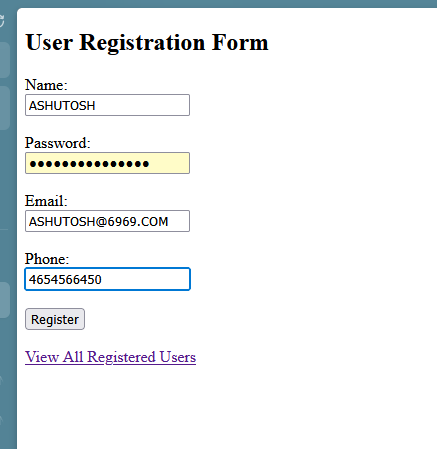

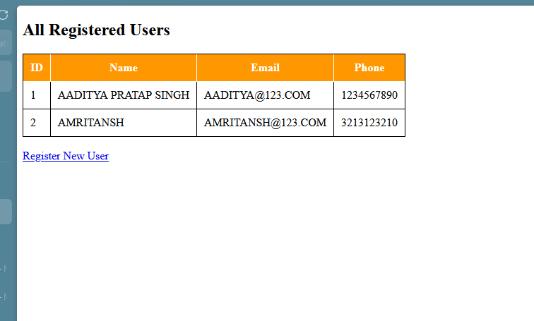

---

#### Q22a — Book Query Servlet with JDBC
**File:** `src/homeWork/servlet/Q22_BookQueryServlet.java`
**Form:** `WebContent/book_query.html`
**URL:** `http://localhost:8080/AJP/book_query.html`

Servlet to query book details (book_id, book_name, book_author, published_date) using JDBC. Supports search by book ID and displays all records.

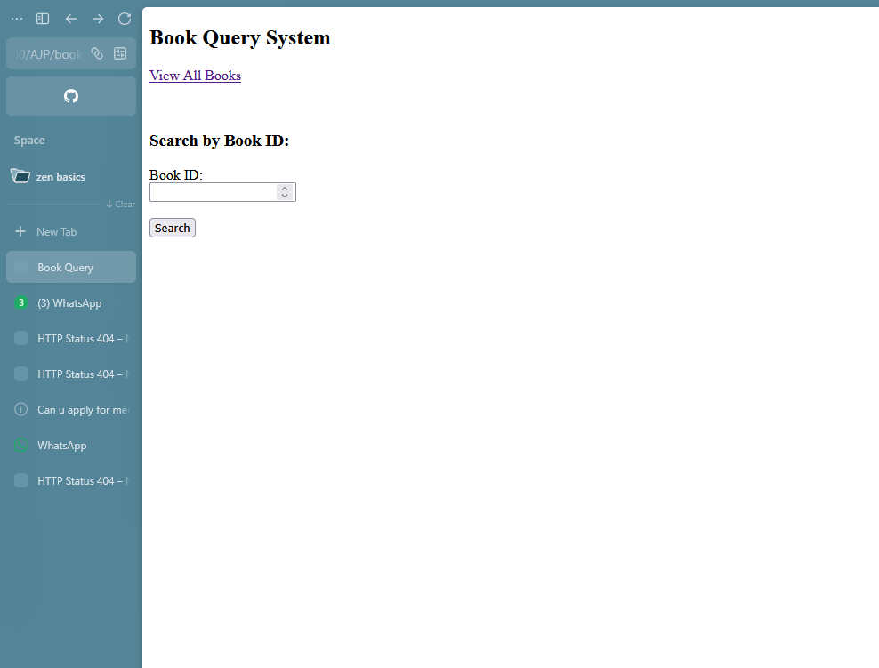

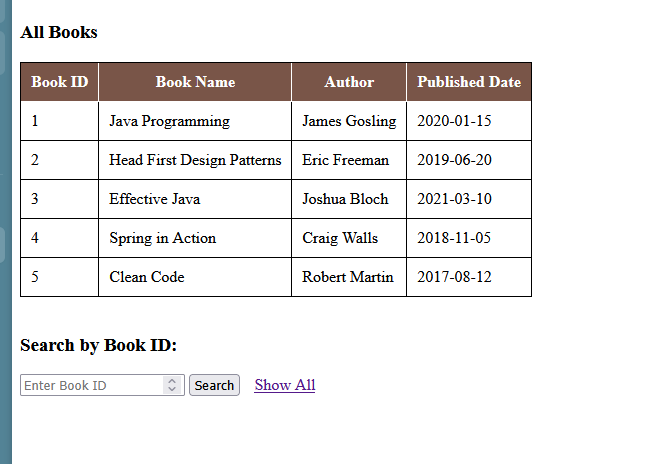

---

#### Q22b — Simple Application Suite

##### Login Form
**File:** `src/homeWork/servlet/Q22b_LoginServlet.java`
**Form:** `WebContent/login.html`
**URL:** `http://localhost:8080/AJP/login.html`

Simple login form that validates credentials against the database. New users are auto-registered on first login attempt.

##### Customer Feedback Form
**File:** `src/homeWork/servlet/Q22b_FeedbackServlet.java`
**Form:** `WebContent/feedback.html`
**URL:** `http://localhost:8080/AJP/feedback.html`

Customer feedback form capturing name, email, rating (1-5), and comments. Stores submissions in the database.

##### Admission Form
**File:** `src/homeWork/servlet/Q22b_AdmissionServlet.java`
**Form:** `WebContent/admission.html`
**URL:** `http://localhost:8080/AJP/admission.html`

Student admission form with fields: student name, father's name, DOB, course selection, email, phone, and address. Stores all data in MySQL.

##### Student Mark Sheet
**File:** `src/homeWork/servlet/Q22b_MarkSheetServlet.java`
**Form:** `WebContent/marksheet.html`
**URL:** `http://localhost:8080/AJP/marksheet.html`

Takes student marks in Maths, English, Science, and Computer Science. Calculates total, percentage, and grade (A+ to F). Generates a formatted mark sheet.

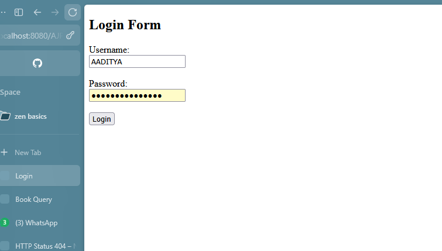

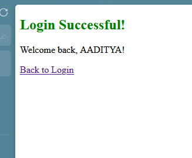

---

### Day 3 — JSP Programs

---

#### Q31 — File Upload to Server
**File:** `src/main/webapp/Q31_upload.jsp`
**URL:** `http://localhost:8080/AJP/Q31_upload.jsp`

JSP page with a file upload form. Uses `request.getPart()` (Jakarta Servlet 6.0) to handle multipart upload. Stores files in `WEB-INF/uploads/` and displays file name, size, and upload time.

---

#### Q32 — Visitor Counter
**File:** `src/main/webapp/Q32_visitor.jsp`
**URL:** `http://localhost:8080/AJP/Q32_visitor.jsp`

JSP page with a submit button that increments a visitor count stored in the `application` (ServletContext) scope. Demonstrates the `application` implicit object. Counter resets when the server restarts.

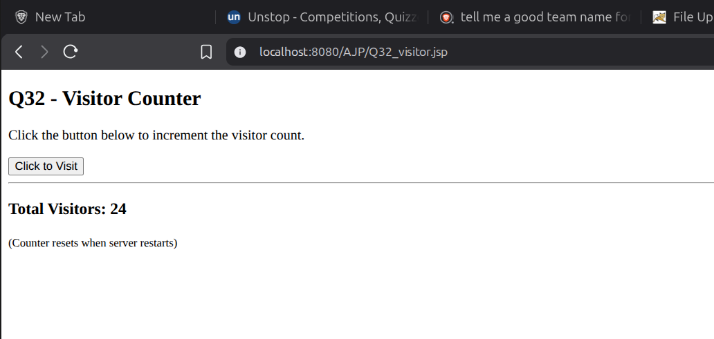

---

#### Q33 — Session Tracking: Color Selection
**Files:** `src/main/webapp/Q33_index.jsp`, `src/main/webapp/Q33_print.jsp`
**URL:** `http://localhost:8080/AJP/Q33_index.jsp`

Two-page JSP demo for session tracking. `Q33_index.jsp` displays a list of colors (Red, Green, Blue, Yellow, Purple, Orange) in a selection box. On submit, `Q33_print.jsp` stores the selection in session, displays the chosen color and its string length. Session preserves the selection across page visits.

**Flow:**
1. User opens `Q33_index.jsp` — sees color array and length of each
2. User selects a color and submits
3. `Q33_print.jsp` stores color in `session` and displays it along with its character count
4. Refreshing `Q33_print.jsp` or navigating back to `Q33_index.jsp` preserves the selection via session

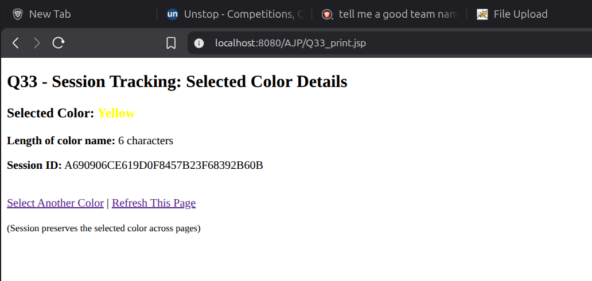

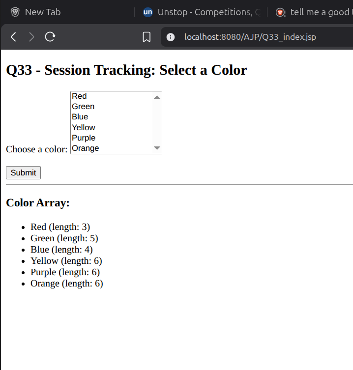

---

#### Q34 — Arithmetic Exception Error Handling
**Files:** `src/main/webapp/Q34_arith.html`, `src/main/webapp/Q34_calculate.jsp`, `src/main/webapp/Q34_error.jsp`
**URL:** `http://localhost:8080/AJP/Q34_arith.html`

Demonstrates JSP error handling directives:
- **`errorPage`** directive in `Q34_calculate.jsp` points to `Q34_error.jsp`
- **`isErrorPage`** directive in `Q34_error.jsp` enables the `exception` implicit object

**Flow:**
1. User enters two numbers in `Q34_arith.html` and submits
2. `Q34_calculate.jsp` performs division
3. If divisor is 0, an `ArithmeticException` is thrown and control passes to `Q34_error.jsp`
4. `Q34_error.jsp` displays exception type, message, and explains the directive usage

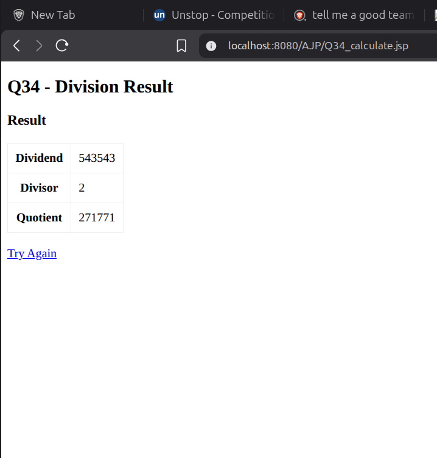

---

## How to Run

### Using Maven (Linux / macOS / Windows WSL)

This project uses **Maven** for building. All sources are under `src/main/java/` and web content under `src/main/webapp/`.

#### Build and Package

```bash
# Build the WAR file
mvn clean package

# WAR is created at: target/AJP.war
```

#### Run JDBC Programs (Q1-Q9)

These are standalone Java applications. No server needed.

```bash
# 1. Compile all code
mvn compile

# 2. Run a specific JDBC program
java -cp "target/classes:mysql-connector-j-9.7.0.jar" classWork.Q1_JDBCConnectivity
java -cp "target/classes:mysql-connector-j-9.7.0.jar" classWork.Q2_EmpTable
java -cp "target/classes:mysql-connector-j-9.7.0.jar" homeWork.Q7_BatchInsert

# Or use the convenience script:
./compile.sh runjdbc classWork.Q1_JDBCConnectivity
```

Note: Ensure MySQL is running on `localhost:3306` and the databases are created (`demo_db`, `bank_db`, `company`, `employee_db`).

#### Run Servlet Programs (Q10-Q22b)

These require Apache Tomcat 10.1.x.

1. **Build the WAR:**
   ```bash
   mvn clean package
   ```

2. **Deploy to Tomcat:**
   ```bash
   # Copy the generated WAR to Tomcat's webapps directory
   cp target/AJP.war ~/opt/tomcat/webapps/
   
   # Or use the convenience script
   ./compile.sh deploy
   ```

3. **Start Tomcat:**
   ```bash
   ~/opt/tomcat/bin/startup.sh
   # Or: ./compile.sh tomcat-start
   ```

4. **Open browser** and navigate to `http://localhost:8080/AJP/` URLs listed below

5. **Stop Tomcat:**
   ```bash
   ~/opt/tomcat/bin/shutdown.sh
   # Or: ./compile.sh tomcat-stop
   ```

### Using compile.sh (Convenience Script)

```bash
./compile.sh build          # Build WAR only
./compile.sh deploy         # Build and copy to Tomcat
./compile.sh tomcat-start   # Start Tomcat server
./compile.sh tomcat-stop    # Stop Tomcat server
./compile.sh runjdbc Q1     # Run Q1 JDBC program (use class name as shorthand)
```

### Using compile.bat (Windows / Eclipse)

1. Ensure Java 21, Tomcat 10.1.57, and MySQL are installed.
2. Open `compile.bat` and update paths if needed.
3. Run `compile.bat` from the command line.
4. For JDBC programs (Q1-Q9), compile and run directly with javac/java.

### Quick Reference: All Servlet URLs

| Q | Type | URL |
|---|------|-----|
| 10 | Servlet | `http://localhost:8080/AJP/EmployeeDetails` |
| 11 | Servlet | `http://localhost:8080/AJP/employee_registration.html` |
| 12 | Servlet | `http://localhost:8080/AJP/name_password_form.html` |
| 13 | Servlet | `http://localhost:8080/AJP/RedirectToGoogle` |
| 14 | Servlet | `http://localhost:8080/AJP/session_form.html` |
| 15 | Servlet | `http://localhost:8080/AJP/urlrewrite_form.html` |
| 16 | Servlet | `http://localhost:8080/AJP/CookieSession` |
| 17 | Servlet | `http://localhost:8080/AJP/user_form.html` |
| 18 | Servlet | `http://localhost:8080/AJP/EmpSelect` |
| 19 | Servlet | `http://localhost:8080/AJP/cookie_form.html` |
| 20 | Servlet | `http://localhost:8080/AJP/RedirectToHTML` |
| 21 | Servlet | `http://localhost:8080/AJP/registration.html` |
| 22a | Servlet | `http://localhost:8080/AJP/book_query.html` |
| 22b | Servlet | `http://localhost:8080/AJP/login.html` |
| 22b | Servlet | `http://localhost:8080/AJP/feedback.html` |
| 22b | Servlet | `http://localhost:8080/AJP/admission.html` |
| 22b | Servlet | `http://localhost:8080/AJP/marksheet.html` |
| 31 | JSP | `http://localhost:8080/AJP/Q31_upload.jsp` |
| 32 | JSP | `http://localhost:8080/AJP/Q32_visitor.jsp` |
| 33 | JSP | `http://localhost:8080/AJP/Q33_index.jsp` |
| 34 | JSP | `http://localhost:8080/AJP/Q34_arith.html` |

---

## Tech Stack

| Component | Version |
|-----------|---------|
| Java | 21 |
| Apache Tomcat | 10.1.57 |
| MySQL | 9.x |
| MySQL Connector/J | 9.7.0 |
| Jakarta Servlet API | 6.0 |
| Build System | Maven 3.9+ |
| IDE | VS Code (recommended) or Eclipse |

## Project Structure

```
AJP/
├── pom.xml                         # Maven build file
├── compile.sh                      # Linux build/deploy convenience script
├── compile.bat                     # Windows build script (legacy)
├── mysql-connector-j-9.7.0.jar     # MySQL JDBC driver
├── src/
│   └── main/
│       ├── java/                   # Java sources
│       │   ├── classWork/          # JDBC standalone programs (Q1-Q6)
│       │   │   └── servlet/        # Classwork servlets (Q11-Q17)
│       │   └── homeWork/           # JDBC standalone programs (Q7-Q9)
│       │       └── servlet/        # Homework servlets (Q10, Q18-Q22b)
│       └── webapp/                 # Web content
│           ├── WEB-INF/
│           │   ├── web.xml         # Deployment descriptor
│           │   └── lib/            # JARs (mysql-connector)
│           └── *.html              # Static HTML forms
├── .vscode/                        # VS Code workspace config
│   ├── settings.json
│   ├── tasks.json
│   └── extensions.json
├── target/                         # Maven build output (gitignored)
│   ├── classes/
│   └── AJP.war
├── Pictures/                       # Screenshots
└── README.md

---

## Database Configuration

All programs use:
- **Host:** `localhost:3306`
- **Username:** `root`
- **Password:** `aaditya@123`

Databases used:
| Database | Used By |
|----------|---------|
| `demo_db` | Q1, Q2, Q3, Q4, Q6, Q7, Q10, Q11, Q12, Q17, Q21, Q22a, Q22b |
| `bank_db` | Q5 |
| `company` | Q8 |
| `employee_db` | Q9, Q10, Q18 |

Tables are auto-created by each program if they don't exist.
